# REST Assured API Test Automation Framework


A professional-grade REST API test automation framework built with **REST Assured 5.3.2** and **TestNG 7.9.0**, covering three real-world APIs across three distinct authentication strategies, an embedded WireMock mock server with both file-based and programmatic stubs, JSON Schema validation, data-driven testing via external JSON files, and rich Allure reporting with AspectJ-woven step tracking.

---

## Table of Contents

1. [Overview](#overview)
2. [Framework Architecture](#framework-architecture)
3. [End-to-End Workflow](#end-to-end-workflow)
4. [APIs Under Test](#apis-under-test)
5. [Technology Stack](#technology-stack)
6. [VS Code Extensions](#vs-code-extensions)
7. [Project Structure](#project-structure)
8. [Design Patterns](#design-patterns)
9. [Complete Test Inventory](#complete-test-inventory)
10. [Key Features](#key-features)
    - [JSON Schema Validation](#json-schema-validation)
    - [WireMock Stubbing](#wiremock-stubbing)
    - [Data-Driven Architecture](#data-driven-architecture)
    - [Allure Reporting](#allure-reporting)
    - [Multi-Authentication Coverage](#multi-authentication-coverage)
    - [CI/CD Configuration Override](#cicd-configuration-override)
11. [Security](#security)
12. [Setup & Installation](#setup--installation)
13. [Running Tests](#running-tests)
14. [Generating Allure Reports](#generating-allure-reports)
15. [Failure Demonstration Tests](#failure-demonstration-tests)

---

## Overview

This framework was built as a portfolio project to demonstrate a production-quality approach to REST API test automation. It covers multiple test methods across several test classes, exercising **distinct authentication strategies** — OAuth 2.0 Bearer Token, Cookie Session Token, and JWT Bearer with token refresh.

Test data is fully externalized through **data-driven iterations** backed by JSON files, with no hardcoded values inside test methods. Response contracts are enforced using **JSON Schema** files that validate structure, field types, enum values, and array constraints independently of assertion-level checks.

The framework integrates a **WireMock embedded mock server** running two complementary stub approaches — file-based JSON mapping files for declarative stub definitions, and programmatic stubs with request matching on body content and headers for fine-grained control. **Allure reporting** captures the full test lifecycle through an `@Epic` / `@Feature` / `@Story` / `@Step` annotation hierarchy with AspectJ load-time weaving for step-level granularity on private methods.

All credentials are read from `config.properties` with transparent **environment variable override**, making the project safe to commit and ready to run in any CI/CD pipeline without code changes.

---

## Framework Architecture

```
┌──────────────────────────────────────────────────────────────────────┐
│                     REST ASSURED TEST FRAMEWORK                      │
├──────────────────────────────────────────────────────────────────────┤
│                                                                      │
│  ┌─────────────────────────────────────────────────────────────┐    │
│  │  REPORTING LAYER                                            │    │
│  │  Allure 2.27.0 — @Epic / @Feature / @Story / @Step         │    │
│  │  AspectJ 1.9.22.1 — load-time weaving for @Step on         │    │
│  │  private methods via javaagent in surefire argLine          │    │
│  └─────────────────────────────────────────────────────────────┘    │
│                              ▲                                       │
│  ┌─────────────────────────────────────────────────────────────┐    │
│  │  TEST LAYER                                                 │    │
│  │  GitHubTests  BookerTests  PlatziTests                      │    │
│  │  WireMockTests  StubDemoTests                               │    │
│  │  DataProviders  (7 providers, 7 external JSON files)        │    │
│  └─────────────────────────────────────────────────────────────┘    │
│                              ▲                                       │
│  ┌───────────────────┐  ┌────────────────────────────────────────┐  │
│  │  SPEC LAYER       │  │  MOCK LAYER                            │  │
│  │  BookerSpecs      │  │  WireMock 3.5.4 (embedded)             │  │
│  │  GitHubSpecs      │  │  File-based stubs (mappings/__files)   │  │
│  │  PlatziSpecs      │  │  Programmatic stubs (body+header match)│  │
│  │  (RequestSpec +   │  │  Call verification                     │  │
│  │   ResponseSpec)   │  └────────────────────────────────────────┘  │
│  └───────────────────┘                                              │
│                              ▲                                       │
│  ┌────────────────────┐  ┌──────────────────────────────────────┐   │
│  │  MODELS LAYER      │  │  SCHEMA LAYER                        │   │
│  │  15 POJOs          │  │  6 JSON Schemas (Draft-07)           │   │
│  │  Lombok @Data      │  │  github-user, github-repo,           │   │
│  │  @Builder          │  │  github-repos-array,                 │   │
│  │  Jackson           │  │  booking, product                    │   │
│  │  @JsonProperty     │  └──────────────────────────────────────┘   │
│  └────────────────────┘                                             │
│                              ▲                                       │
│  ┌────────────────────┐  ┌──────────────────────────────────────┐   │
│  │  CONSTANTS LAYER   │  │  UTILS LAYER                         │   │
│  │  ApiConstants      │  │  TestUtils                           │   │
│  │  Base URLs         │  │  uniqueName(), randomId()            │   │
│  │  Endpoint paths    │  │  dateOffset(), logResult()           │   │
│  │  Schema paths      │  └──────────────────────────────────────┘   │
│  └────────────────────┘                                             │
│                              ▲                                       │
│  ┌─────────────────────────────────────────────────────────────┐    │
│  │  CONFIG LAYER                                               │    │
│  │  ConfigManager (Thread-safe Singleton)                      │    │
│  │  config.properties ← Environment Variable Override          │    │
│  │  github.token → GITHUB_TOKEN  booker.username → BOOKER_USERNAME │
│  └─────────────────────────────────────────────────────────────┘    │
│                                                                      │
└──────────────────────────────────────────────────────────────────────┘
```

---

## End-to-End Workflow

```mermaid
flowchart TD
    A(["`**mvn test**
    -DsuiteXmlFile=testng.xml`"]) --> B

    B["**Maven Surefire Plugin**
    Reads suiteXmlFile
    Injects AspectJ javaagent into JVM
    for Allure @Step weaving"]

    B --> C["**TestNG Suite Runner**
    Loads testng.xml
    Resolves group filters
    Orders tests by @Priority
    Builds dependsOnMethods graph"]

    C --> D["**@BeforeClass Setup**
    ConfigManager loads config.properties
    Env-var overrides applied
    Credentials extracted
    WireMock server started on dynamic port
    File-based stubs loaded from mappings/"]

    D --> E{Data-driven?}

    E -->|Yes| F["**DataProvider**
    Jackson reads JSON from testdata/
    Returns Object[][] rows
    Injected as test method params"]

    E -->|No| G

    F --> G["**Spec Builder**
    BookerSpecs / GitHubSpecs / PlatziSpecs
    RequestSpecification: baseURI + auth headers
    ResponseSpecification: status + time limit"]

    G --> H["**POJO Serialization**
    Lombok @Builder constructs request object
    Jackson serializes POJO → JSON body
    @JsonProperty handles snake_case mapping"]

    H --> I["**REST Assured HTTP Call**
    given(spec).when().METHOD(endpoint)"]

    I --> J{Target}

    J -->|Real API| K["**External API**
    GitHub api.github.com
    Booker restful-booker.herokuapp.com
    Platzi api.escuelajs.co"]

    J -->|Mock| L["**WireMock Server**
    localhost:dynamic port
    File-based or programmatic stub matched"]

    K --> M
    L --> M

    M["**Response Validation**
    Status code + response time ← ResponseSpec
    JSON Schema ← matchesJsonSchemaInClasspath
    POJO deserialization ← response.as(Class)
    Field assertions ← assertEquals / assertNotNull
    WireMock verify ← server.verify(N, requestedFor)"]

    M --> N{Result}

    N -->|Pass| O["**Allure Capture**
    AspectJ-woven @Step timeline
    @Epic → @Feature → @Story → @Step
    allure-results/ written to disk"]

    N -->|Fail| P["**Allure Failure Capture**
    Test marked FAILED
    Response body attached
    Failure Note attached
    Stack trace captured"]

    O --> Q
    P --> Q

    Q(["**mvn allure:serve**
    HTML report opens in browser"])

    style A fill:#2d6a4f,color:#fff
    style Q fill:#2d6a4f,color:#fff
    style K fill:#1565c0,color:#fff
    style L fill:#6a1b9a,color:#fff
    style P fill:#b71c1c,color:#fff
    style O fill:#1b5e20,color:#fff
```



---

## APIs Under Test

| API | Base URL | Authentication Strategy | HTTP Methods Tested | Test Class |
|-----|----------|------------------------|--------------------|-----------:|
| GitHub REST API v3 | `api.github.com` | OAuth 2.0 Bearer Token (PAT) | GET, POST, DELETE | `GitHubTests` |
| Restful-Booker | `restful-booker.herokuapp.com` | Cookie Session Token | GET, POST, PUT | `BookerTests` |
| Platzi Fake Store | `api.escuelajs.co/api/v1` | JWT Bearer + Refresh Token | GET, POST | `PlatziTests` |
| WireMock (file-based) | `localhost:dynamic` | Cookie Token (mocked) | GET, POST, PUT, DELETE | `WireMockTests` |
| WireMock (programmatic) | `localhost:dynamic` | None (open stubs) | GET, POST, PUT, DELETE | `StubDemoTests` |

---

## Technology Stack

| Tool | Version | Purpose |
|------|---------|---------|
| Java | 21 | Language; virtual thread support, modern APIs |
| Maven | 3.9+ | Build tool, dependency management, test runner |
| REST Assured | 5.3.2 | BDD-style DSL for HTTP API testing |
| TestNG | 7.9.0 | Test runner: groups, DataProviders, priority ordering, `dependsOnMethods` |
| Hamcrest | 2.2 | Fluent assertion matchers used inside REST Assured's `.body()` |
| json-schema-validator | 5.3.2 | JSON Schema Draft-07 validation via `matchesJsonSchemaInClasspath()` |
| WireMock | 3.5.4 | Embedded HTTP mock server; file-based and programmatic stub support |
| Allure TestNG | 2.27.0 | Rich HTML test reports with `@Epic`, `@Feature`, `@Story`, `@Step` |
| AspectJ Weaver | 1.9.22.1 | Load-time weaving for `@Step` annotation on private methods |
| Lombok | 1.18.38 | `@Data`, `@Builder`, `@AllArgsConstructor` for POJO boilerplate elimination |
| Jackson Databind | 2.15.3 | JSON serialization/deserialization; `@JsonProperty` for snake_case mapping |
| SLF4J + Logback | 2.0.13 / 1.5.6 | Structured logging throughout framework |
| Maven Surefire | 3.3.1 | Bridges TestNG XML suites; injects AspectJ javaagent via `argLine` |
| Allure Maven Plugin | 2.12.0 | `mvn allure:report` and `mvn allure:serve` report generation |

---

## VS Code Extensions

| Extension | Publisher | Purpose |
|-----------|-----------|---------|
| Extension Pack for Java | Microsoft | Java language support, IntelliSense, debugging |
| Test Runner for Java | Microsoft | Run/debug TestNG tests from the editor |
| Maven for Java | Microsoft | Maven lifecycle and dependency management in sidebar |
| Lombok Annotations Support | GabrielBB | Prevents false "cannot find symbol" errors for Lombok-generated methods |
| REST Client | Huachao Mao | Send ad-hoc HTTP requests for exploratory testing |
| GitLens | GitKraken | Git history, blame, and branch management |

**Recommended workspace settings** (`.vscode/settings.json`):
```json
{
    "java.compile.nullAnalysis.mode": "automatic",
    "java.configuration.updateBuildConfiguration": "automatic"
}
```

> **Note:** TestNG XML suite files (`testng.xml`, `testng-smoke.xml`, `testng-regression.xml`) cannot be run via VS Code's Test Explorer UI — use the terminal with `mvn test -DsuiteXmlFile=...` instead.

---

## Project Structure

```
rest-assured-project/
│
├── pom.xml                              # Maven build config, all dependencies
├── testng.xml                           # FULL suite  — group "full"  (19 tests)
├── testng-regression.xml                # Regression  — group "regression" (17 tests)
├── testng-smoke.xml                     # Smoke       — group "smoke" (6 tests)
├── requirements.txt                     # System prerequisites
│
├── src/
│   ├── main/java/com/apiframework/
│   │   ├── config/
│   │   │   └── ConfigManager.java       # Thread-safe singleton; env var override
│   │   ├── constants/
│   │   │   └── ApiConstants.java        # All URLs, endpoint paths, header values, schema paths
│   │   ├── models/
│   │   │   ├── booker/                  # BookingRequest, BookingDates, BookingWrapper,
│   │   │   │                            #   TokenRequest, TokenResponse
│   │   │   ├── github/                  # GitHubUser, GitHubRepo, CreateRepoRequest
│   │   │   ├── platzi/                  # LoginRequest, LoginResponse, PlatziUser,
│   │   │   │                            #   Product, CreateProductRequest, RefreshTokenRequest
│   │   │   └── wiremock/
│   │   │       └── MockBooking.java     # Lightweight flat POJO for WireMock responses
│   │   ├── specs/
│   │   │   ├── BookerSpecs.java         # baseSpec(), authenticatedSpec(), successSpec(), forbiddenSpec()
│   │   │   ├── GitHubSpecs.java         # authorizedSpec(), withTokenSpec(), createdSpec(), noContentSpec()
│   │   │   └── PlatziSpecs.java         # baseSpec(), authorizedSpec(), authResponseSpec()
│   │   └── utils/
│   │       └── TestUtils.java           # uniqueName(), randomId(), dateOffset(), logResult()
│   │
│   └── test/
│       ├── java/com/apiframework/
│       │   ├── dataproviders/
│       │   │   └── DataProviders.java   # 7 @DataProvider methods; reads from testdata/ JSON files
│       │   └── tests/
│       │       ├── github/GitHubTests.java    # TC_GH_001 – TC_GH_005
│       │       ├── booker/BookerTests.java    # TC_RB_001 – TC_RB_007 (TC_RB_007 intentionally fails)
│       │       ├── platzi/PlatziTests.java    # TC_PF_001 – TC_PF_006 (TC_PF_006 intentionally fails)
│       │       ├── wiremock/WireMockTests.java # TC_WM_001 – TC_WM_004
│       │       └── stub/StubDemoTests.java    # TC_SD_001 – TC_SD_004
│       │
│       └── resources/
│           ├── config.properties        # API credentials (placeholders; override via env vars)
│           ├── allure.properties        # Allure results directory config
│           ├── logback-test.xml         # Logback configuration for test runs
│           ├── schemas/
│           │   ├── booking-schema.json              # TC_RB_002 — POST /booking response
│           │   ├── booking-strict-negative.json     # TC_RB_007 — strict schema (intentional failure)
│           │   ├── product-schema.json              # TC_PF_004 — POST /products response
│           │   ├── github-user-schema.json          # TC_GH_001 — GET /user response
│           │   ├── github-repo-schema.json          # TC_GH_004 — single repo object
│           │   └── github-repos-array-schema.json   # TC_GH_003 — array of repos
│           ├── testdata/
│           │   ├── booker-create-booking-data.json
│           │   ├── booker-update-booking-data.json
│           │   ├── booker-negative-booking-data.json
│           │   ├── booking-guest-data.json       # 3 rows for TC_RB_006
│           │   ├── github-invalid-tokens.json    # 3 rows for TC_GH_002
│           │   ├── platzi-invalid-tokens.json    # 3 rows for TC_PF_003
│           │   ├── platzi-product-data.json
│           │   └── stub-demo-data.json           # Drives BOTH stub bodies AND assertions
│           └── wiremock/
│               ├── mappings/                     # File-based stub definitions (JSON)
│               │   ├── get-all-bookings.json
│               │   ├── get-booking-by-id.json
│               │   ├── post-create-booking.json
│               │   ├── put-update-booking.json
│               │   └── delete-booking.json
│               └── __files/                      # Response body files referenced by mappings
│                   ├── bookings-list.json
│                   ├── booking-single.json
│                   ├── booking-created.json
│                   └── booking-updated.json
```

---

## Design Patterns

### 1. Request/Response Specification Pattern
Each API has a dedicated Spec class that returns pre-built `RequestSpecification` and `ResponseSpecification` objects. Tests call the spec and chain their own endpoint and body — no repeated configuration:

```java
// GitHubSpecs.java
public static RequestSpecification authorizedSpec() {
    return new RequestSpecBuilder()
        .setBaseUri(ConfigManager.getInstance().getProperty("github.base.url"))
        .addHeader("Authorization", "Bearer " + token)
        .addHeader("X-GitHub-Api-Version", ApiConstants.GITHUB_API_VERSION)
        .addHeader("Accept", ApiConstants.GITHUB_ACCEPT_HEADER)
        .build();
}

// In test:
given(GitHubSpecs.authorizedSpec())
    .when().get(ApiConstants.GITHUB_USER)
    .then().spec(GitHubSpecs.successSpec())
    .body(matchesJsonSchemaInClasspath(ApiConstants.SCHEMA_GITHUB_USER));
```

### 2. Builder Pattern (Lombok)
All request POJOs use `@Builder` for readable, null-safe construction without telescoping constructors:

```java
BookingRequest body = BookingRequest.builder()
    .firstname(firstname)
    .lastname(lastname)
    .totalprice(totalprice)
    .depositpaid(depositpaid)
    .bookingdates(BookingDates.builder()
        .checkin(TestUtils.dateOffset(5))
        .checkout(TestUtils.dateOffset(10))
        .build())
    .additionalneeds(additionalneeds)
    .build();
```

### 3. Singleton Pattern (ConfigManager)
`ConfigManager` uses double-checked locking to ensure one instance loads `config.properties` once per JVM, with thread-safe access:

```java
public static ConfigManager getInstance() {
    if (instance == null) {
        synchronized (ConfigManager.class) {
            if (instance == null) {
                instance = new ConfigManager();
            }
        }
    }
    return instance;
}
```

### 4. Data Provider Pattern (Externalized JSON)
All test data lives in JSON files under `testdata/`. `DataProviders` loads each file via Jackson's `ObjectMapper` and returns `Object[][]` to TestNG:

```java
@DataProvider(name = "bookingGuestData")
public static Object[][] bookingGuestData() throws IOException {
    JsonNode rows = loadJson("testdata/booking-guest-data.json");
    Object[][] data = new Object[rows.size()][5];
    for (int i = 0; i < rows.size(); i++) {
        JsonNode row = rows.get(i);
        data[i] = new Object[]{
            row.get("firstname").asText(), row.get("lastname").asText(),
            row.get("totalprice").asInt(), row.get("depositpaid").asBoolean(),
            row.get("additionalneeds").asText()
        };
    }
    return data;
}
```

### 5. POJO Deserialization with Jackson
Responses are deserialized into typed POJOs using `@JsonProperty` for snake_case ↔ camelCase mapping and `@JsonIgnoreProperties(ignoreUnknown = true)` to silently absorb extra fields from real APIs:

```java
@Data
@Builder
@JsonIgnoreProperties(ignoreUnknown = true)
public class GitHubUser {
    private String login;
    private Long id;
    @JsonProperty("avatar_url")  private String avatarUrl;
    @JsonProperty("public_repos") private Integer publicRepos;
    @JsonProperty("created_at")  private String createdAt;
}

// In test:
GitHubUser user = response.as(GitHubUser.class);
assertNotNull(user.getLogin());
assertEquals(user.getType(), "User");
```

### 6. Dependency Chain Pattern
`dependsOnMethods` creates an ordered chain where each test reuses the state (token, booking ID) obtained by the previous test — mirroring real-world API workflows:

```
TC_RB_001 (generate token)
    └─→ TC_RB_002 (create booking → stores bookingId)
            └─→ TC_RB_003 (retrieve booking by ID)
            └─→ TC_RB_004 (update booking — needs token + bookingId)
            └─→ TC_RB_005 (reject update without token)
```

---

## Complete Test Inventory

| TC ID | Test Name | HTTP | Endpoint | Groups | Data-Driven | Schema |
|-------|-----------|------|----------|--------|------------|--------|
| TC_GH_001 | Authenticate & fetch profile | GET | `/user` | smoke, regression, full | — | github-user |
| TC_GH_002 | Authentication failure | GET | `/user` | regression, full | 3 invalid tokens | — |
| TC_GH_003 | List repositories | GET | `/user/repos` | regression, full | — | github-repos-array |
| TC_GH_004 | Create repository | POST | `/user/repos` | regression, full | — | github-repo |
| TC_GH_005 | Delete repository | DELETE | `/repos/{owner}/{repo}` | regression, full | — | — |
| TC_RB_001 | Generate auth token | POST | `/auth` | smoke, regression, full | — | — |
| TC_RB_002 | Create booking + schema | POST | `/booking` | smoke, regression, full | 1 booking | booking |
| TC_RB_003 | Retrieve booking by ID | GET | `/booking/{id}` | regression, full | — | — |
| TC_RB_004 | Full update (PUT) | PUT | `/booking/{id}` | regression, full | 1 update set | — |
| TC_RB_005 | Update without token (403) | PUT | `/booking/{id}` | regression, full | 1 attempt | — |
| TC_RB_006 | Data-driven booking creation | POST | `/booking` | regression, full | 3 guests | — |
| TC_RB_007 | Strict schema validation failure | GET | `/booking/{id}` | regression, full | — | booking-strict-negative |
| TC_PF_001 | User login + obtain JWT | POST | `/auth/login` | smoke, regression, full | — | — |
| TC_PF_002 | Get profile with JWT | GET | `/auth/profile` | regression, full | — | — |
| TC_PF_003 | Invalid auth → 401 | GET | `/auth/profile` | regression, full | 3 invalid tokens | — |
| TC_PF_004 | Create product + schema | POST | `/products` | regression, full | 1 product | product |
| TC_PF_005 | Refresh JWT token | POST | `/auth/refresh-token` | regression, full | — | — |
| TC_PF_006 | Negative price business rule | POST | `/products` | regression, full | — | — |
| TC_WM_001 | GET all bookings (file stub) | GET | `/mock/bookings` | smoke, full | — | — |
| TC_WM_002 | POST create booking (body match) | POST | `/mock/bookings` | regression, full | — | — |
| TC_WM_003 | PUT update booking (header match) | PUT | `/mock/bookings/1` | full | — | — |
| TC_WM_004 | DELETE booking (file stub) | DELETE | `/mock/bookings/1` | full | — | — |
| TC_SD_001 | GET list items (programmatic stub) | GET | `/api/items` | smoke, regression, full | — | — |
| TC_SD_002 | POST create item | POST | `/api/items` | regression, full | — | — |
| TC_SD_003 | PUT update item | PUT | `/api/items/1` | regression, full | — | — |
| TC_SD_004 | DELETE item | DELETE | `/api/items/1` | regression, full | — | — |

---

## Key Features

### JSON Schema Validation

Five JSON Schema (Draft-07) files validate that API responses conform to their expected contract — independently of field-level assertions. This catches structural regressions (missing required fields, wrong types, broken array constraints) that assertion-only tests miss.

```
schemas/
├── github-user-schema.json         → TC_GH_001  GET /user
├── github-repos-array-schema.json  → TC_GH_003  GET /user/repos (array root)
├── github-repo-schema.json         → TC_GH_004  POST /user/repos (single object)
├── booking-schema.json             → TC_RB_002  POST /booking
├── product-schema.json             → TC_PF_004  POST /products
└── booking-strict-negative.json    → TC_RB_007  strict schema requiring booking_reference (intentionally fails)
```

**Schema features used:**
- `"type": "string", "enum": ["User", "Organization", "Bot"]` — constrains GitHub account type
- `"pattern": ".+/.+"` — enforces `owner/repo` format on `full_name`
- `"minimum": 0` on `price` — enforces non-negative pricing rule
- `"minItems": 1` on `images` — enforces images array is never empty
- `"additionalProperties": true` on GitHub schemas — safely accepts GitHub's 30+ extra fields
- `"additionalProperties": false` on Booker schema — strict contract; any extra field fails

```java
// Usage in test
.then()
    .spec(GitHubSpecs.successSpec())
    .body(matchesJsonSchemaInClasspath(ApiConstants.SCHEMA_GITHUB_USER))
    .body("login", not(nullValue()))
    .body("type", equalTo("User"));
```

---

### WireMock Stubbing

The framework demonstrates **two complementary WireMock approaches** in separate test classes:

#### File-Based Stubs (`WireMockTests`)
Stub definitions are JSON files loaded automatically when the server starts with `usingFilesUnderClasspath("wiremock")`. Response bodies live in `wiremock/__files/` and are referenced via `"bodyFileName"`.

```
wiremock/
├── mappings/
│   ├── get-all-bookings.json       →  GET  /mock/bookings       → 200 bookings-list.json
│   ├── get-booking-by-id.json      →  GET  /mock/bookings/{id}  → 200 booking-single.json
│   ├── post-create-booking.json    →  POST /mock/bookings       → 201 booking-created.json
│   ├── put-update-booking.json     →  PUT  /mock/bookings/{id}  → 200 booking-updated.json
│   └── delete-booking.json         →  DELETE /mock/bookings/{id} → 204 (no body)
└── __files/
    ├── bookings-list.json
    ├── booking-single.json
    ├── booking-created.json
    └── booking-updated.json
```

#### Programmatic Stubs (`WireMockTests` + `StubDemoTests`)
Registered via `stubFor()` — stub fires only if the incoming request matches a condition:

```java
// POST stub — fires only when request body contains "Alice"
wireMockServer.stubFor(
    post(urlEqualTo(ApiConstants.MOCK_BOOKINGS))
        .withHeader("Content-Type", containing("application/json"))
        .withRequestBody(containing("Alice"))
        .willReturn(aResponse()
            .withStatus(201)
            .withHeader("Content-Type", "application/json")
            .withBodyFile("booking-created.json"))
);

// PUT stub — fires only when Authorization header matches "Bearer .+"
wireMockServer.stubFor(
    put(urlMatching(ApiConstants.MOCK_BOOKING_BY_ID))
        .withHeader("Authorization", matching("Bearer .+"))
        .willReturn(aResponse()
            .withStatus(200)
            .withBodyFile("booking-updated.json"))
);
```

**Call verification** proves the stub was actually reached:
```java
wireMockServer.verify(1,
    postRequestedFor(urlEqualTo(ApiConstants.MOCK_BOOKINGS))
        .withRequestBody(containing("Alice"))
);
```

**Priority (LIFO):** Programmatic stubs registered last are matched first. File-based stubs loaded at startup act as fallback.

---

### Data-Driven Architecture

All test data is externalized to JSON files under `src/test/resources/testdata/`. No literal values appear in test method bodies.

| File | Rows | Consumed By |
|------|------|-------------|
| `booking-guest-data.json` | 3 | TC_RB_006 (3 independent booking iterations) |
| `github-invalid-tokens.json` | 3 | TC_GH_002 (3 negative auth scenarios) |
| `platzi-invalid-tokens.json` | 3 | TC_PF_003 (3 invalid token types) |
| `booker-create-booking-data.json` | 1 | TC_RB_002 |
| `booker-update-booking-data.json` | 1 | TC_RB_004 |
| `booker-negative-booking-data.json` | 1 | TC_RB_005 |
| `platzi-product-data.json` | 1 | TC_PF_004 |
| `stub-demo-data.json` | — | TC_SD_001–004 (also drives stub response bodies) |

**Single source of truth — `stub-demo-data.json`** powers both the WireMock stub response bodies and the test assertions simultaneously. Editing one JSON file updates the expected contract in both places:

```json
{
  "get":  { "response": [{"id":1,"name":"Widget A","price":29.99}, ...] },
  "post": { "request": {"name":"Widget C","price":99.99},
            "response": {"id":3,"name":"Widget C","price":99.99} },
  "put":  { "request": {"name":"Widget A Updated","price":39.99},
            "response": {"id":1,"name":"Widget A Updated","price":39.99} }
}
```

**Null token handling** in `TC_PF_003` — JSON `null` triggers conditional spec selection:
```java
String token = row.get("token").isNull() ? null : row.get("token").asText();

// In test:
RequestSpecification spec = (invalidToken == null)
    ? PlatziSpecs.baseSpec()          // no Authorization header
    : PlatziSpecs.authorizedSpec(invalidToken);  // invalid Bearer value
```

---

### Allure Reporting

Tests are annotated with a four-level Allure hierarchy and `@Step` methods give the timeline view a detailed breakdown of each test's execution:

```java
@Epic("REST Assured Framework")
@Feature("Pure Programmatic Stubbing")
public class StubDemoTests {

    @Test
    @Story("TC_SD_001 — GET stub returns list")
    @Severity(SeverityLevel.CRITICAL)
    @Description("Registers a GET /api/items stub programmatically from stub-demo-data.json ...")
    public void TC_SD_001_getItems() throws IOException {
        executeGet();
        assertGetResponse();
        verifyGetCallMade();
    }

    @Step("Execute GET /api/items")
    private void executeGet() { ... }

    @Step("Assert GET response matches expected items")
    private void assertGetResponse() { ... }
}
```

**AspectJ weaving** is required for `@Step` on private methods. Configured in `pom.xml`:
```xml
<argLine>
    -javaagent:${settings.localRepository}/org/aspectj/aspectjweaver/1.9.22.1/aspectjweaver-1.9.22.1.jar
    --enable-native-access=ALL-UNNAMED
</argLine>
```

Generate and view the report:
```bash
mvn allure:report   # generates target/site/allure-maven-plugin/index.html
mvn allure:serve    # generates + opens in browser automatically
```

---

### Multi-Authentication Coverage

The framework validates three distinct authentication strategies, including negative tests that confirm unauthorized access is rejected:

| Strategy | API | How Applied | Negative Test |
|----------|-----|-------------|---------------|
| OAuth 2.0 Bearer Token (PAT) | GitHub | `Authorization: Bearer <token>` header | TC_GH_002 — 3 invalid token shapes → 401 |
| Cookie Session Token | Restful-Booker | `Cookie: token=<session>` header | TC_RB_005 — PUT with no cookie → 403 |
| JWT Bearer + Refresh | Platzi Fake Store | `Authorization: Bearer <jwt>` header | TC_PF_003 — null/plain/malformed JWT → 401 |

**JWT structural validation** in TC_PF_005 confirms the refreshed token is a valid JWT format without decoding the payload:
```java
String newToken = response.jsonPath().getString("access_token");
String[] parts = newToken.split("\\.");
assertEquals(parts.length, 3, "JWT must have 3 dot-separated segments");
```

---

### CI/CD Configuration Override

`config.properties` contains only placeholder values — safe to commit to version control. `ConfigManager` transparently substitutes environment variables when present:

```
github.token      → GITHUB_TOKEN
booker.username   → BOOKER_USERNAME
booker.password   → BOOKER_PASSWORD
platzi.email      → PLATZI_EMAIL
platzi.password   → PLATZI_PASSWORD
```

Key conversion: dot-notation property key → `UPPER_SNAKE_CASE` environment variable name.

**Local setup** — edit `config.properties`:
```properties
github.token=ghp_your_personal_access_token_here
booker.username=admin
booker.password=password123
platzi.email=john@mail.com
platzi.password=changeme
```

**CI pipeline** — export secrets as environment variables instead:
```bash
export GITHUB_TOKEN=ghp_your_token
export BOOKER_USERNAME=admin
export BOOKER_PASSWORD=password123
mvn test -DsuiteXmlFile=testng.xml
```

---

## Security

> **Never commit a real token or password to this repository.**

`config.properties` is committed intentionally — but only with **placeholder** values so cloners can see the required keys at a glance. The file must never contain a real credential.

### What is safe to commit

| File | Safe? | Reason |
|------|-------|--------|
| `config.properties.example` | Yes | Template only — all values are placeholders |
| `config.properties` | **No (gitignored)** | Holds your real credentials locally; excluded by `.gitignore` |
| `.env` / `*.env.local` / `secrets.properties` | No (gitignored) | Explicitly excluded in `.gitignore` |

### Before running GitHub tests locally

1. Copy the template: `cp src/test/resources/config.properties.example src/test/resources/config.properties`
2. Replace `REPLACE_WITH_YOUR_GITHUB_PERSONAL_ACCESS_TOKEN` with your real token
3. `config.properties` is gitignored — it will never be staged or committed

### Token scopes required

Generate a **Classic Personal Access Token** at [https://github.com/settings/tokens](https://github.com/settings/tokens) with these scopes checked:

| Scope | Required for |
|-------|-------------|
| `repo` | TC_GH_004 — create repository via `POST /user/repos` |
| `delete_repo` | TC_GH_005 — delete repository via `DELETE /repos/{owner}/{repo}` |

### CI/CD — use environment variables instead

Never put real tokens in the file during CI. Export secrets as environment variables; `ConfigManager` picks them up automatically:

```bash
export GITHUB_TOKEN=ghp_your_token
export BOOKER_USERNAME=admin
export BOOKER_PASSWORD=password123
export PLATZI_EMAIL=john@mail.com
export PLATZI_PASSWORD=changeme

mvn clean test -DsuiteXmlFile=testng.xml
```

---

## Setup & Installation

### Prerequisites

| Requirement | Version | Notes |
|-------------|---------|-------|
| Java JDK | 21+ | `java -version` to verify |
| Apache Maven | 3.9+ | `mvn -version` to verify |
| GitHub Personal Access Token | — | Scopes: `repo`, `delete_repo` (see [Security](#security)) |

### Steps

1. **Clone the repository**
   ```bash
   git clone https://github.com/meghana-mp/rest-assured-project.git
   cd rest-assured-project
   ```

2. **Configure credentials**

   `config.properties` is gitignored. Copy the committed template and fill in your token:
   ```bash
   cp src/test/resources/config.properties.example \
      src/test/resources/config.properties
   ```
   Then edit `config.properties`:
   ```properties
   github.token=ghp_YOUR_PERSONAL_ACCESS_TOKEN
   booker.username=admin
   booker.password=password123
   platzi.email=john@mail.com
   platzi.password=changeme
   ```

   Booker and Platzi use public test credentials that work out of the box. Only the GitHub token requires a real value.

3. **Install dependencies**
   ```bash
   mvn clean install -DskipTests
   ```

---

## Running Tests

```bash
# Smoke suite — 6 critical-path sanity checks (fastest)
mvn test -DsuiteXmlFile=testng-smoke.xml

# Regression suite — 19 tests
mvn test -DsuiteXmlFile=testng-regression.xml

# Full suite — all 21 tests
mvn test -DsuiteXmlFile=testng.xml

# Clean build + full suite
mvn clean test -DsuiteXmlFile=testng.xml
```

---

## Generating Allure Reports

```bash
# Run tests first to generate allure-results/
mvn clean test -DsuiteXmlFile=testng.xml

# Generate static HTML report (opens in browser)
mvn allure:serve

# Generate static HTML only (no auto-open)
mvn allure:report
# Report location: target/site/allure-maven-plugin/index.html
```

---

## Failure Demonstration Tests

Two tests — one in `BookerTests` and one in `PlatziTests` — are designed to fail against real APIs. They exist to show what a failing test looks like in the Allure report, with the actual response body and a diagnostic note attached as artifacts so the root cause is immediately visible.

| TC ID | Class | Type | What Fails | Allure Attachments |
|-------|-------|------|-----------|-------------------|
| TC_RB_007 | `BookerTests` | Schema validation failure | GET `/booking/{id}` response is missing required `booking_reference` field — schema validator catches the contract violation | Actual Response Body, Failure Note |
| TC_PF_006 | `PlatziTests` | Business rule violation | POST `/products` with `price: -50`; test expects `422 Unprocessable Entity` but Platzi returns `400 Bad Request` — the semantically correct HTTP status for a business rule violation is 422, not 400 | Actual Response Body, Failure Note |

Both tests run as part of the **regression** and **full** suites.

### What you see in the Allure report

**TC_RB_007 — Schema validation failure**

`booking-strict-negative.json` requires a `booking_reference` field that the Booker API never returns. The JSON Schema validator raises:
```
1 validation error(s):
required key [booking_reference] not found
```
The **Actual Response Body** attachment shows the raw booking JSON. The **Failure Note** names the missing field and which schema triggered the failure.

**TC_PF_006 — Business rule violation**

A product with `price: -50` is posted to Platzi. The test asserts `HTTP 422` because `422 Unprocessable Entity` is the semantically correct status for a business rule violation. Platzi does validate the input but returns `400 Bad Request` instead. TestNG reports:
```
expected [422] but found [400]
```
The **Actual Response Body** shows Platzi's rejection response. The **Failure Note** documents the HTTP semantics gap: *Platzi returns 400 (generic client error) instead of 422 (unprocessable content — the correct signal for a constraint violation)*.

---

> Built with REST Assured, TestNG, WireMock, and Allure — demonstrating production-quality API test automation patterns.
